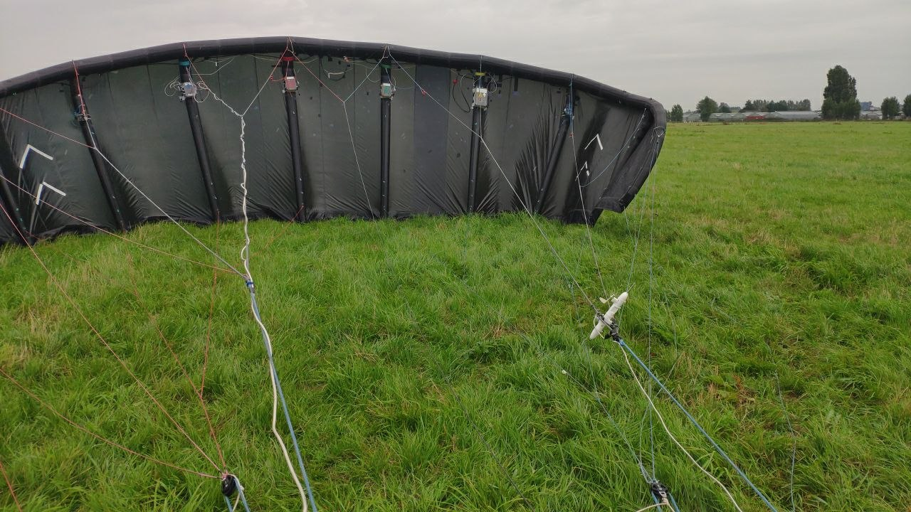

# Kite power flight data acquired on 8 October 2019

For this specific test, the 25m² leading edge inflatable V3 kite was flown, which was also used by Oehler [[1](#Oehler2017)] in 2017 but with a different measurement configuration. The kite was equipped with a newly designed flow measurement setup to replace the less robust measurement setup of Oehler. Conservative operational settings were used as the test was focused on data acquisition rather than maximising energy production. Therefore, the power output during the test was lower than that for normal operation. Also, the system configuration was already dated at the time of the test and has gone through substantial development since then, e.g., Kitepower nowadays employs a much larger kite with an improved design. 

The measurements were performed with the 100 kW technology development platform of Kitepower B.V., which is a spin-off company from Delft University of Technology. For this particular test flight, the kite power system was equipped with a Leading Edge Inflatable (LEI) V3 kite. The traction force was transferred to the ground station by a tether made of Dyneema. A general description of the kite power system is given in [[2](#Vlugt2013), [3](#Salma2020), [4](#Roullier2020)].

| Kite                          |          | Tether   |           |
|-------------------------------|----------|----------|-----------|
| Total wing area               | 25 m²    | Density  | 724 kg/m³ |
| Projected wing area           | 19.75 m² | Diameter | 10 mm     |
| Canopy mass                   | 11 kg    |          |           |
| Canopy-mounted equipment mass | 3.2 kg   |          |           |
| KCU mass                      | 25 kg    |          |           |
| KCU frontal area              | 0.25  m² |          |           |

## Description of the test flight
The test flight took place at the former naval air base Valkenburg in the Netherlands with the ground station positioned at a latitude of 52.1691°, a longitude of 4.4310°, and an elevation of −5 m (below sea level). It lies close to Leiden and near the coast which is roughly 3.5 km away towards the west. The direct surrounds are mostly flat open land with some more vegetation towards the dune area at the coast. The wind conditions were moderate with a westerly wind of roughly 5 m/s at the start, which gradually changed to a west-southwesterly wind of roughly 7 m/s. The conservative operations enabled a flight of approximately three hours in which 87 pumping cycles were flown.

Each cycle consists of a traction phase where the kite flies figure of eight maneuvers and a retraction phase with transition phases in between. We have divided the original dataset (2019-10-08_11-36-20_ProtoLogger_phases.csv) in separate csv-files for each cycle, which start with the transition into traction phase. All cycles have a similar altitude profile and flight path. To outline the flight path, we describe that of the 65th pumping cycle next. The traction phase fully comes into effect at the lowest altitude around 130 m. In the traction phase the kite flies 3 and a half figure of eight maneuvers after which it exceeds 200 m altitude. In the subsequent transition phase and at the start of the reel-in phase, the kite rises up to roughly 270 m after which the kite is lowered by retracting the tether. We appended three columns for flight section identifiers that differ from the original ones. The new identifiers allow  differentiating between flight sections in a more detailed manner, e.g., differentiating between left and right turns, and are particularly useful when comparing with simulation results.   

The new flow measurement setup has been made more compact compared to earlier experiments. It still employs a Pitot tube to measure the relative flow velocity together with a single orthogonal wind vane to measure the flow angle parallel to the symmetry plane of the kite. For this specific flight test, the sideslip was not measured. The relative flow sensors are mounted off-center at the lower knot of the left power line. The pressure, temperature, position (GPS), and attitude (IMU) at the kite were measured by two Pixhawks, one on each of the center struts. Also the tether force, reel out speed, and wind speed/direction are measured at the ground station. The data was recorded at a frequency of 10 Hz.

## Terms and requests concerning using the data:
The contents of this repository are published under a CC-BY 4.0 license: the data can be used as long as attribution is made to this repository. Nevertheless, if you pursue a publication that uses the data we request you to:
- Stress that the test flight does not represent the state-of-the-art of Kitepower as (1) the system configuration was already dated at the time of the test and has gone through substantial development since then (e.g. Kitepower nowadays employs a much larger kite) and (2) the test was focused on data acquisition rather than maximising energy production; 
- Acknowledge Kitepower and include a link to www.kitepower.nl;
- Send the preprint including the data via email to publications@kitepower.nl;
- Allow Kitepower to post the preprint of the publication on kitepower.nl and/or Kitepower-related networks, if such public posting is in accordance with the agreement between author and publisher.

## Content of the data set

The acquired data is provided in csv-format. In the content description we use the following abbreviations:
- NED: North-East-Down earth-fixed reference frame
- FRD: Forward-Right-Down body-fixed reference frame

|     | Variable                    | Description                                                                                                                                                                                     | Unit             |
|----:|:----------------------------|:------------------------------------------------------------------------------------------------------------------------------------------------------------------------------------------------|:-----------------|
|   1 | time                        | Unix time stamp: number of seconds since 0:00 UTC at January 1, 1970                                                                                                                            | s                |
|   2 | date                        | Date                                                                                                                                                                                            | dd-mm-yyyy       |
|   3 | time_of_day                 | Time                                                                                                                                                                                            | hh:mm:ss (UTC+2) |
|   4 | airspeed_temperature        | Air temperature                                                                                                                                                                                 | °C               |
|   5 | airspeed_angle_of_attack    | Flow angle measured by the flow vane: angle between the apparent wind velocity and the x-axis of the front bridle reference frame in the plane perpendicular to the y-axis                      | deg              |
|   6 | airspeed_apparent_windspeed | Air speed at the Pitot tube (calculated from pressure measurements)                                                                                                                             | m/s              |
|   7 | kite_0_vx                   | x-component of the kite velocity in the NED earth reference frame (follows from the state estimation of sensor 0)                                                                               | m/s              |
|   8 | kite_0_vy                   | y-component of the kite velocity in the NED earth reference frame (follows from the state estimation of sensor 0)                                                                               | m/s              |
|   9 | kite_0_vz                   | z-component of the kite velocity in the NED earth reference frame (follows from the state estimation of sensor 0)                                                                               | m/s              |
|  10 | kite_0_roll                 | Roll angle as part of the 3-2-1 Euler sequence to get from the NED earth to the FRD body reference frame measured by sensor 0                                                                   | deg              |
|  11 | kite_0_pitch                | Pitch angle as part of the 3-2-1 Euler sequence to get from the NED earth to the FRD body reference frame measured by sensor 0                                                                  | deg              |
|  12 | kite_0_yaw                  | Yaw angle as part of the 3-2-1 Euler sequence to get from the NED earth to the FRD body reference frame measured by sensor 0                                                                    | deg              |
|  13 | kite_1_vx                   | x-component of the kite velocity in the NED earth reference frame (follows from the state estimation of sensor 1)                                                                               | m/s              |
|  14 | kite_1_vy                   | y-component of the kite velocity in the NED earth reference frame (follows from the state estimation of sensor 1)                                                                               | m/s              |
|  15 | kite_1_vz                   | z-component of the kite velocity in the NED earth reference frame (follows from the state estimation of sensor 1)                                                                               | m/s              |
|  16 | kite_1_ax                   | x-component of the kite acceleration in the NED earth reference frame measured by sensor 1                                                                                                      | m/s^2            |
|  17 | kite_1_ay                   | y-component of the kite acceleration in the NED earth reference frame measured by sensor 1                                                                                                      | m/s^2            |
|  18 | kite_1_az                   | z-component of the kite acceleration in the NED earth reference frame measured by sensor 1                                                                                                      | m/s^2            |
|  19 | kite_1_roll                 | Roll angle as part of the 3-2-1 Euler sequence to get from the NED earth to the FRD body reference frame measured by sensor 1                                                                   | deg              |
|  20 | kite_1_pitch                | Pitch angle as part of the 3-2-1 Euler sequence to get from the NED earth to the FRD body reference frame measured by sensor 1                                                                  | deg              |
|  21 | kite_1_yaw                  | Yaw angle as part of the 3-2-1 Euler sequence to get from the NED earth to the FRD body reference frame measured by sensor 1                                                                    | deg              |
|  22 | kite_1_roll_rate            | x-component of the kite angular velocity in FRD body reference frame measured by sensor 1                                                                                                       | rad/s            |
|  23 | kite_1_pitch_rate           | y-component of the kite angular velocity in FRD body reference frame measured by sensor 1                                                                                                       | rad/s            |
|  24 | kite_1_yaw_rate             | z-component of the kite angular velocity in FRD body reference frame measured by sensor 1                                                                                                       | rad/s            |
|  25 | ground_upwind_direction     | Instantaneous upwind direction w.r.t. North, positive in clockwise direction when viewed from above, measured with a wind vane at the ground station at 6 m height                              | deg              |
|  26 | ground_wind_velocity        | Instantaneous wind speed measured with an anemometer at the ground station at 6 m height                                                                                                        | m/s              |
|  27 | ground_pos_latitude         | Geodetic latitude of the ground station                                                                                                                                                         | deg              |
|  28 | ground_pos_longitude        | Geodetic longitude of the ground station                                                                                                                                                        | deg              |
|  29 | ground_pos_altitude         | Geodetic altitude of the ground station                                                                                                                                                         | m                |
|  30 | ground_tether_reelout_speed | Reel-out speed of the tether (inferred from the rotational speed of the drum)                                                                                                                   | m/s              |
|  31 | ground_tether_force         | Tether force measured at the ground station (inferred from force on outlet pulley and tether angle)                                                                                             | kg               |
|  32 | est_upwind_direction        | Running average of the instantaneous upwind direction - with which the x-axis of the wind reference frame is aligned                                                                            | deg              |
|  33 | kite_pos_east               | Position of the kite east of the ground station                                                                                                                                                 | m                |
|  34 | kite_pos_north              | Position of the kite north of the ground station                                                                                                                                                | m                |
|  35 | kite_height                 | Height of the kite with respect to the ground station                                                                                                                                           | m                |
|  36 | kite_elevation              | Elevation angle of the kite with respect to the ground station                                                                                                                                  | rad              |
|  37 | kite_azimuth                | Azimuth angle of the kite with respect to the ground station in the wind reference frame (see est_upwind_direction), clockwise positive when viewed from above                                  | rad              |
|  38 | kite_distance               | Radial position of the kite with respect to the ground station                                                                                                                                  | m                |
|  39 | kite_heading                | Angle between the axis pointing up and the kite x-axis projection onto the tangential plane, clockwise positive when looking from above the kite towards the origin                             | rad              |
|  40 | kite_course                 | Angle between the axis pointing up and the kite velocity projection onto the tangential plane, clockwise positive when looking from above the kite towards the origin                           | rad              |
|  41 | kite_actual_steering        | Level of realized steering actuation as percentage of the range in one direction                                                                                                                | %                |
|  42 | kite_actual_depower         | Level of realized depower as percentage of the full range                                                                                                                                       | %                |
|  43 | kite_set_steering           | Set/desired value of steering actuation as percentage of the range in one direction                                                                                                             | %                |
|  44 | kite_set_depower            | Set/desired depower as percentage of the full range                                                                                                                                             | %                |
|  45 | ground_mech_energy          | Generated mechanical energy at winch since the start of the test flight                                                                                                                         | J                |
|  46 | ground_mech_power           | Mechanical power measured at the winch                                                                                                                                                          | W                |
|  47 | flight_phase                | Label of the active flight phase: pp-ro = reel-out/pp-ri = reel-in/pp-rori = reel-out to reel-in transition/pp-riro = reel-in to reel-out transition                                            | -                |
|  48 | flight_phase_index          | Index of the active flight phase: 1-4                                                                                                                                                           | -                |
|  49 | phase                       | Flight phase index after dividing the reel-in to reel-out transition and reel-out phase into two parts: 0-5 (added by TU Delft)                                                                 | -                |
|  50 | pattern                     | Counter for half a figure of eight manoeuvres (added by TU Delft)                                                                                                                               | -                |
|  51 | pattern_section             | Index of different flight sections within the reel-out phase: 0 = right turn/1 = right to left straight section/2 = left turn/3 = left to right straight section/-1 = other (added by TU Delft) | -                |

## References

<a name="Oehler2018b">[1]</a> Johannes Oehler, Roland Schmehl: "Aerodynamic characterization of a soft kite by in situ flow measurement". Wind Energy Science, 2018. https://doi.org/10.5194/wes-2018-46

<a name="Vlugt2013">[2]</a> Rolf van der Vlugt, Johannes Peschel, Roland Schmehl: "Design and Experimental Characterization of a Pumping Kite Power System". In: Uwe Ahrens, Moritz Diehl, Roland Schmehl (eds.) Airborne Wind Energy. Green Energy and Technology, chap. 23, pp. 403–425, Springer, Berlin Heidelberg, 2013. https://doi.org/10.1007/978-3-642-39965-7_23

<a name="Roullier2020">[3]</a> Arthur Roullier: "Experimental analysis of a kite system’s dynamics". MSc Thesis, EPFL, 2020. https://doi:10.5281/zenodo.7752407

<a name="Salma2020">[4]</a> Volkan Salma, Felix Friedl, Roland Schmehl: "Improving reliability and safety of airborne wind energy systems". Wind Energy, 2020; 23: 340– 356. https://doi.org/10.1002/we.2433

## Authors

Mark Schelbergen¹, Roland Schmehl¹ (email: r.schmehl@tudelft.nl), Bert Buchholz², Joep Breuer², and Johannes Peschel²

¹ Faculty of Aerospace Engineering, Delft University of Technology, Kluyverweg 1, 2629 HS Delft, The Netherlands

² [Kitepower B.V.](http://kitepower.nl/), Schieweg 15, Hall R, 2627 AN Delft, The Netherlands

## License

This data set is licensed under the 

## Acknowledgements

The authors are grateful to Pietro Fagianni, Piek Kuppers, Johannes Stark, and Vincenz Malke for operating the system during the test flight.
